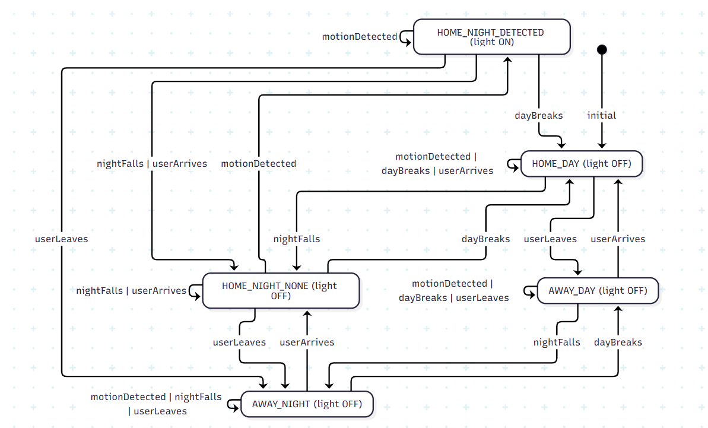
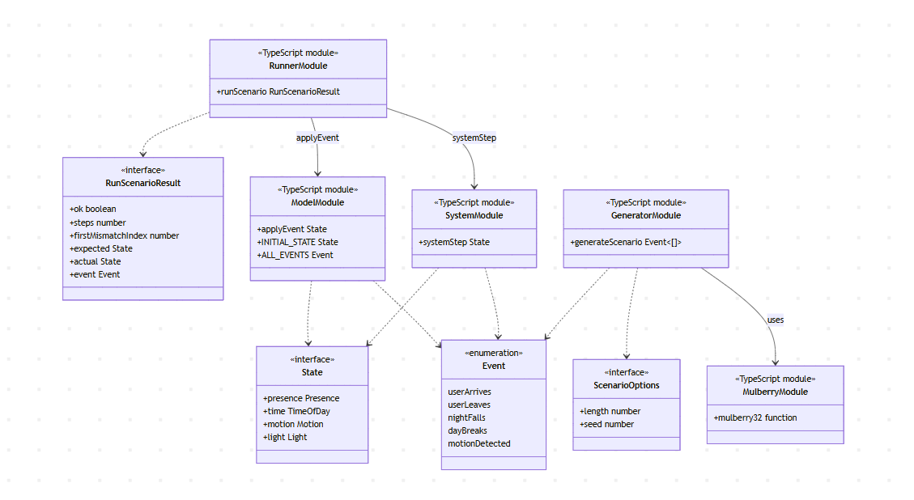

# MBT Smart Home

## Overview

This project is a small **model-based testing (MBT)** example written in TypeScript.

The idea is simple:
- `model/` contains the **reference model** of the system behaviour
- `system/` contains the **system under test**
- `generator/` creates reproducible pseudo-random event sequences
- `runner/` executes the same scenario on both sides and compares their states after each step

If the model and the system diverge, the test reports the first mismatching step together with the expected and actual state.

## Scenario

The project models a simple smart-home lighting rule for a hallway light.

The system tracks:
- whether the user is **HOME** or **AWAY**
- whether it is **DAY** or **NIGHT**
- whether motion is **DETECTED** or **NONE**
- whether the light is **ON** or **OFF**

The intended behaviour is:

- when the user leaves, the light must be turned **OFF**
- during the day, the light must remain **OFF**
- if nobody is home, the light must remain **OFF**
- the light may turn **ON** only when the user is **HOME**, it is **NIGHT**, and motion is detected

A typical example trace is:

`nightFalls -> motionDetected -> dayBreaks`

Starting from the initial state

`HOME, DAY, NONE, OFF`

the states evolve as follows:

1. `nightFalls`  
   → `HOME, NIGHT, NONE, OFF`

2. `motionDetected`  
   → `HOME, NIGHT, DETECTED, ON`

3. `dayBreaks`  
   → `HOME, DAY, NONE, OFF`

This is the core behaviour that the MBT setup checks automatically across many generated scenarios.

## Project structure

- `src/model/` – reference model, state types, initial state, transitions
- `src/system/` – system under test
- `src/generator/` – scenario generation and seeded PRNG
- `src/runner/` – scenario execution and state comparison
- `src/mbt.example.test.ts` – example MBT tests with Vitest
- `src/index.ts` – small batch runner for executing multiple scenarios

## How it works

1. A scenario is generated as a sequence of events.
2. The same sequence is applied to:
    - the reference model (`applyEvent`)
    - the system under test (`systemStep`)
3. After each event, the runner compares both states.
4. If they differ, execution stops and reports:
    - the failing step
    - the event that caused the divergence
    - the expected state
    - the actual state

## Deterministic scenario generation

Scenarios are generated with a seeded pseudo-random number generator (`mulberry32`).

This makes test runs reproducible:
the same seed always produces the same event sequence.

That is useful when debugging failures, because a failing scenario can be replayed exactly.

## Scenario generation strategy

The scenario generator is state-aware.  
Event probabilities depend on the current model state to produce more meaningful sequences.

For example:
- `userArrives` is more likely when the system is `AWAY`
- `dayBreaks` is more likely during `NIGHT`
- `motionDetected` is more likely when `HOME` and `NIGHT`

Events are then selected using weighted random selection.
This balances exploration with realistic transitions.

## State model

The diagram below shows all reachable states and transitions.



## Tests

The project contains two kinds of checks:

### 1. PRNG tests
`mulberry32.test.ts` verifies that the random generator:
- returns values in the expected range
- is reproducible for the same seed
- changes output across calls
- matches a fixed golden sequence

### 2. MBT tests
`mbt.example.test.ts` generates multiple random scenarios and checks that the model and the system stay equivalent throughout the run.

### 3. XState example tests

An additional example demonstrates model-based testing using XState.  
A small state machine is defined and random event sequences are executed against it to verify valid transitions.  
This shows how MBT can also be expressed using explicit state machines and path-based testing.

## Logical Structure

## Run

Install dependencies:

```bash
npm install
```


Build:

```bash
npm run build
```

Run the batch MBT check:

```bash
npm start
```

Run tests:

```bash
npm test
```

## Notes

This is a compact educational MBT example.
It does not try to explore the full state space systematically; instead, it uses reproducible pseudo-random scenarios to compare a model against an implementation.